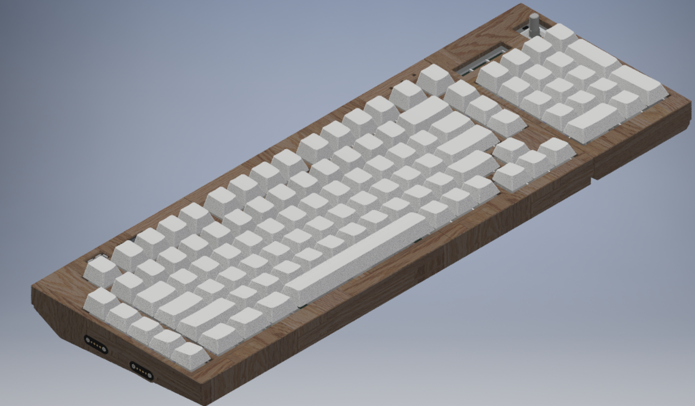
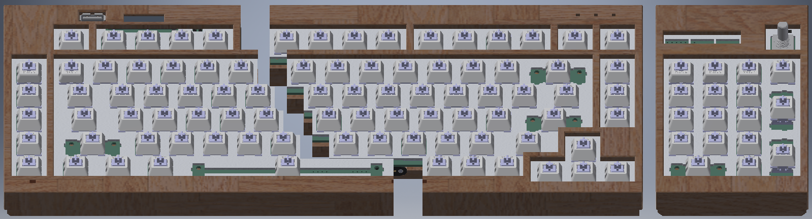
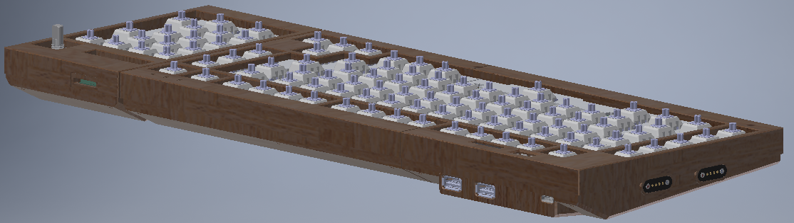

# Numlocked: Shift
## A modular, customizable split keyboard with multiple layouts, integrated volume control, and USB hub.

## Directory:
- [Keyboard Hardware](hardware/readme.md)
- [Keyboard Firmware](firmware/readme.md)
- [Keyboard Case and Plate](case/readme.md)
- [Revision 1](Revision1/readme.md)

## Features
- **Keyboard Features:**
	- **Modular split design**: Split 75% layout, flexible configuration with or without numpad.
	
	- Magnetic connectors for on-the-fly switching
	- **Gasket mounted design**
	- **Integrated Volume Knob**
	- **128x32 OLED**:  
	- **256x64 OLED**: 
	- **Caps-lock, Num-lock and Scroll-Lock LEDs**
	- **Built-in USB Hub**: 3 USB-A ports (1 vertical, 2 horizontal).
	  
- **Hardware**:
	- **Shift-Registered Design**: Potentially faster scanning than traditional matrix-based keyboards.
	- **RP2040 chip**: Power efficient, endlessly customizable, easy to program.
	-  **Real-Time Clock (RTC)**: Keeps accurate time for the user
	- 

## Build Instructions
*See the [Build Guide](hardware/readme.md) for detailed steps.*
## Customization
Firmware, coded in C, which leverages all the features of this keyboard is provided in this repo. [Learn more](firmware/readme.md)
Please note that QMK/VIA are currently incompatible with shift-register based keyboard designs.
