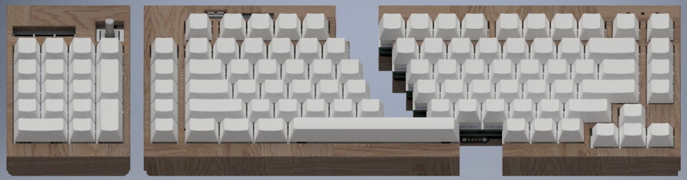
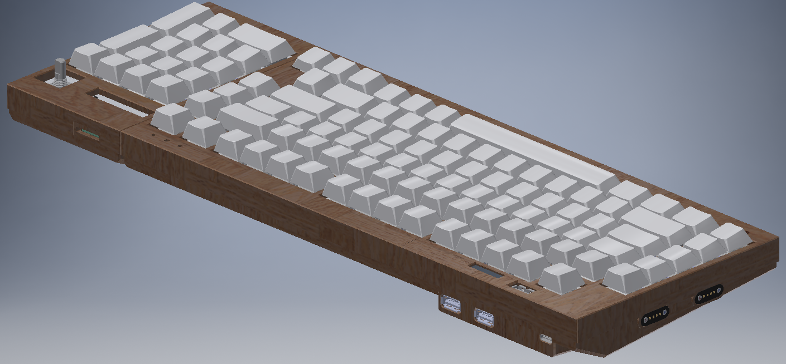

# Numlocked
## A Modular, Customizable Split Keyboard

## Directory:
- [Keyboard Hardware](hardware/readme.md)
- [Keyboard Firmware](firmware/readme.md)
- [Keyboard Case and Plate](case/readme.md)
- [Revision 1](Revision1/readme.md)

## Features
- **Keyboard Features:**
	- **Modular split design**: Split 75% layout, flexible configuration with or without numpad.
	
	- **Magnetic connectors for quick configuration changes**
	- **Hot swappable & Gasket mount design**
	- **Dual-Core Custom Firmware**
	- **Integrated Volume Knob**
	- **128x32 OLED**
	- **Caps-lock, Num-lock and Scroll-Lock LEDs**
	- **Built-in USB Hub**: 3 USB-A ports (1 vertical, 2 horizontal).
	  
- **Hardware**:
	- **Shift-Registered Design**: Potentially faster scanning than traditional matrix-based keyboards.
	- **RP2040 chip**: Power efficient, endlessly customizable, easy to program.
	- **Real-Time Clock (RTC)**: Keeps accurate time for the user
- Build:
	- Akko CS Silver Switches
	- Durock V2 Stabilizers
	- FR4 Plate
	- Red Oak Case

## Build Instructions
*See the [Build Guide](hardware/readme.md) for detailed steps.*
## Customization
Firmware, coded in C, which leverages all the features of this keyboard are provided in this repo. [Learn more](firmware/readme.md)
Please note that QMK/VIA are currently incompatible with shift-register based keyboard designs.
## Often Asked Questions
- Why is it split?
	- For SMD Reflow Soldering, the largest surface area my hotplate could manage was 400x400mm. I also wanted to experiment with ergonomics.
- What was the total cost?
	- Will update once everything is complete.