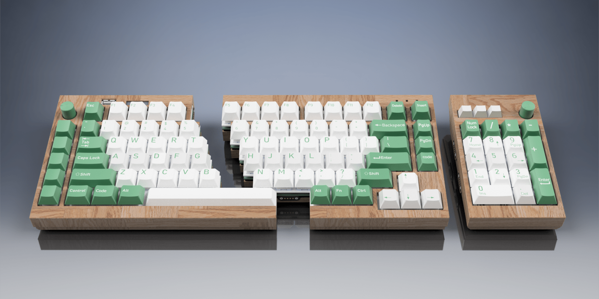
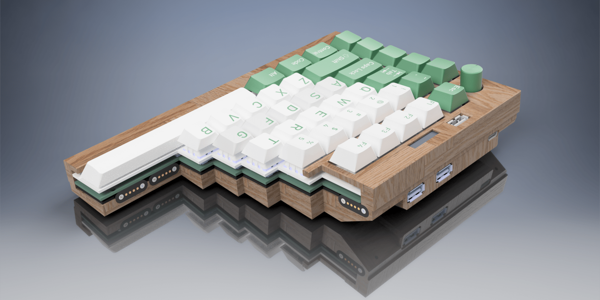
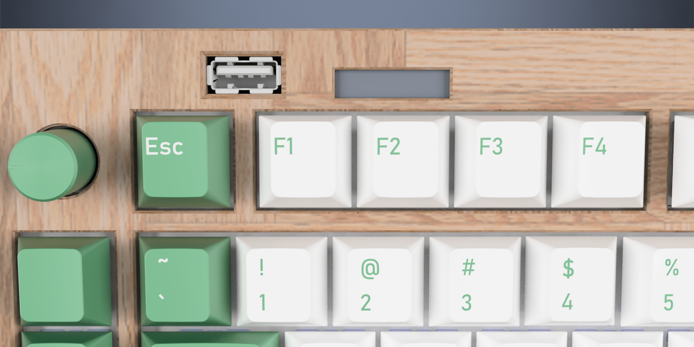

## Directory:
- [Keyboard Hardware](hardware/readme.md)
- [Keyboard Firmware](firmware/readme.md)
- [Keyboard Case and Plate](case/readme.md)
- [Revision 1](Revision1/readme.md)
## Features
### **Keyboard Features:**
#### - **Modular split design**: Split 75% layout, flexible configuration with or without numpad

#### - **Magnetic connectors for quick configuration changes**

#### - **Hot swappable & Gasket mount design**

#### - **Built-in USB Hub**: 3 USB-A ports (1 vertical, 2 horizontal)

#### - **Integrated Volume Knobs**: Two customizable rotary encoders

#### - **128x32 OLED**

#### - **Caps-lock, Num-lock and Scroll-Lock LEDs**

#### - **Dual-Core Custom Firmware**

- **Hardware**:
	- **Shift-Registered Design**: Faster scanning than traditional matrix-based keyboards.
	- **RP2040 chip**: Power efficient, endlessly customizable, easy to program.
	- **Real-Time Clock (RTC)**: Keeps accurate time for the user.
- **Keyboard Build**:
	- Akko CS Silver Switches
	- Durock V2 PCB Mount Stabilizers
	- FR4 Plate
	- Red Oak Case

## Build Instructions
*See the [Build Guide](hardware/readme.md) for detailed steps.*
## Customization
Firmware, coded in C, which leverages all the features of this keyboard are provided in this repo. [Learn more](firmware/readme.md)
Please note that QMK/VIA are currently incompatible with shift-register based keyboard designs.
## Commonly Asked Questions
- Why is it split?
	- I wanted to experiment with ergonomics. Another reason was production, The largest surface area my hotplate could manage was 400x400mm for reflow soldering.
- What was the total cost?
	- Will update once everything is complete.

## Thank you to:
- [SSD1306 library] (https://github.com/daschr/pico-ssd1306) by dachr. I added a function to print both images and text, but it was with his foundations that I was able to quickly get the OLED working.
- [cJSON library] (https://github.com/DaveGamble/cJSON) by DaveGamble. I swear I'm always using this. Its never failed me once. 
- And you, for viewing!
